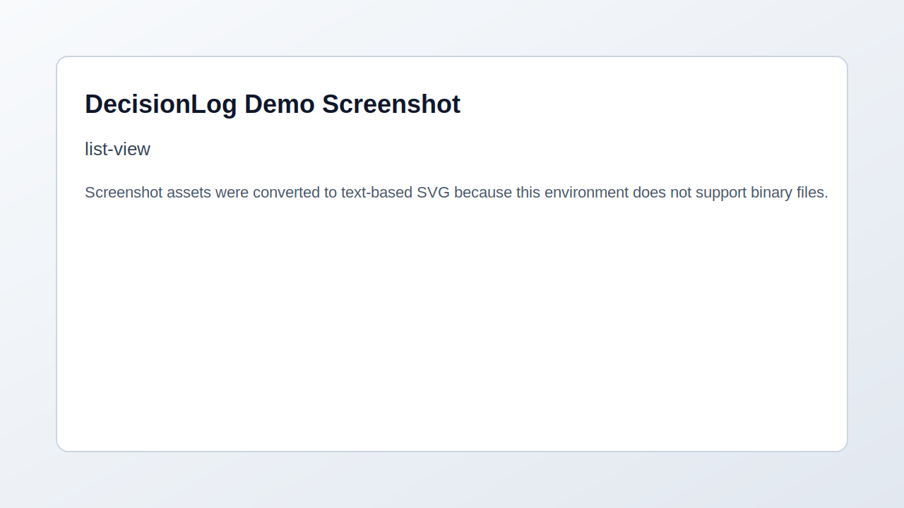
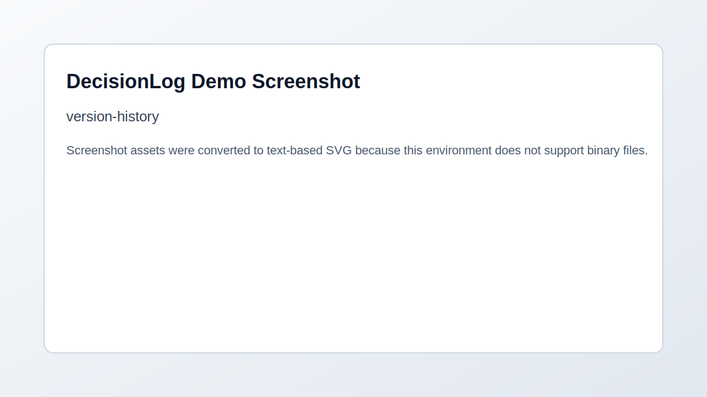

# DecisionLog


Track architecture decisions so your team never loses context.

🔗 **[Live Demo](https://decisionlog-demo.vercel.app)**



Teams constantly lose track of why technical decisions were made. As engineers rotate across projects, critical context disappears into old Slack threads, forgotten docs, and tribal knowledge. ADRs are the right pattern, but markdown files and wiki pages are hard to search and usually missing structured metadata. DecisionLog provides a dedicated system for capturing, evolving, and querying architecture decisions with rich context.

## Features
- Full-text fuzzy search to quickly retrieve past technical decisions.
- Version history to show how proposals evolved into accepted outcomes.
- Stakeholder tagging so teams can see ownership and contributors.
- Impact assessments across performance, security, developer experience, and cost.
- Filtering by status, tags, stakeholders, and date ranges.
- Real-time-ish workflow support via sync and extraction pipelines.

## More Screenshots
**Decision detail view**


**Version history**



**Search results**


## Tech Stack
- **Next.js (App Router)** — React framework and server rendering.
- **Supabase** — managed PostgreSQL/Auth-compatible backend.
- **Prisma** — type-safe ORM with migrations.
- **Tailwind CSS** — utility-first UI styling.
- **Vercel** — deployment and hosting.

## Local Development
Prerequisites: Node.js 18+, PostgreSQL (or Supabase project), GitHub OAuth app.

```bash
git clone https://github.com/[username]/decisionlog.git
cd decisionlog/code
npm install
cp .env.example .env.local
# Fill in env values in .env.local
npx prisma migrate dev
npx prisma db seed
npm run dev
# Open http://localhost:3000
```

## Environment Variables
```bash
NEXT_PUBLIC_APP_URL=           # Public base URL for frontend links
DATABASE_URL=                  # PostgreSQL connection string
NEXT_PUBLIC_DEMO_MODE=         # true enables anonymous read-only demo mode

GITHUB_CLIENT_ID=              # GitHub OAuth app client id
GITHUB_CLIENT_SECRET=          # GitHub OAuth app client secret
GITHUB_REDIRECT_URI=           # OAuth callback URL

JWT_SECRET=                    # Secret used to sign session JWTs
JWT_EXPIRES_IN=                # Session lifetime (e.g., 7d)

ANTHROPIC_API_KEY=             # Anthropic API key for extraction
OPENAI_API_KEY=                # OpenAI API key for extraction
BASE_URL=                      # Optional internal service base URL
```

## Project Structure
```text
app/              # Next.js routes and API handlers
components/       # Reusable UI and feature components
context/          # Global client state
lib/              # Auth, DB, extraction, and utility modules
prisma/           # Prisma schema, migrations, and seed script
docs/screenshots/ # README image assets
```

## Roadmap
- Slack/Teams notifications for status changes.
- Markdown export compatible with adr-tools.
- Team/project role-based permissions.
- Decision templates by domain/use case.
- AI-assisted drafting for consequences and impact predictions.

## License
MIT
