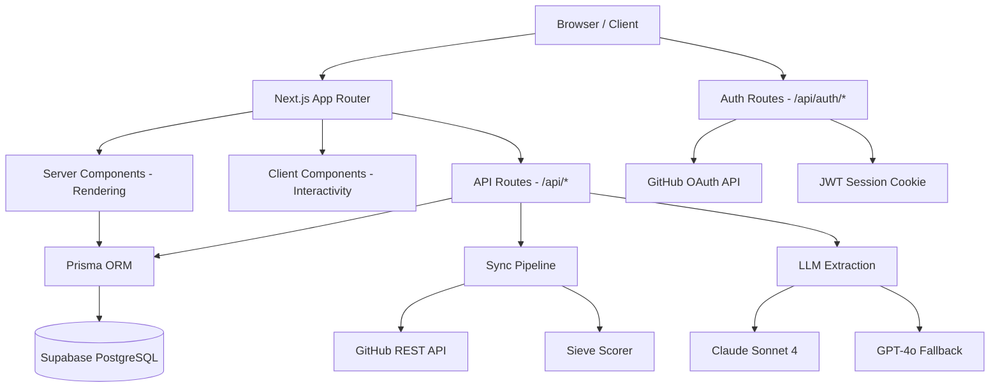

# Architecture

## Overview

DecisionLog is a full-stack Next.js application using the App Router pattern. The application connects to GitHub repositories via OAuth, syncs pull requests and commits, scores them for architectural significance using a rule-based sieve, and then extracts structured Architecture Decision Records using LLM analysis (Claude Sonnet 4 primary, GPT-4o fallback). Prisma handles all database operations against a Supabase-hosted PostgreSQL instance, and JWT cookies manage session state.

## System Diagram



## Processing Pipeline

The core of DecisionLog is a multi-stage pipeline that transforms raw GitHub activity into structured decisions:

```
GitHub PRs/Commits → Fetch → Artifacts (DB)
                                  ↓
                           Sieve Scoring (rule-based)
                                  ↓
                           Candidates (DB)
                                  ↓
                        LLM Extraction (user-triggered)
                                  ↓
                           Decisions (DB)
```

### Stage 1: Fetch (`lib/sync/fetch.ts`)

The sync orchestrator (`lib/sync/orchestrator.ts`) coordinates fetching merged pull requests from GitHub using the REST API via `lib/github/client.ts`. Each PR is stored as an Artifact record with its title, body, diff (truncated to 100KB), file change counts, and author metadata. Cursor-based pagination (`lib/sync/cursor.ts`) enables incremental syncing — only new PRs since the last sync are fetched.

### Stage 2: Sieve (`lib/sieve/scorer.ts`)

Artifacts are scored from 0.0 to 1.0 using a rule-based system that combines three factors:

- **Message score (0–0.4):** Scans the PR title and body for architectural keywords (architecture, design, refactor, database, security, etc.) and applies penalties for noise patterns (dependency bumps, automated changes).
- **PR metadata score (0–0.3):** Evaluates file count and line changes to gauge the scope of the change.
- **Diff score (0–0.3):** Analyzes the actual code diff for architectural signals like config changes, schema modifications, and infrastructure updates.

Artifacts scoring 0.4 or higher are promoted to Candidates.

### Stage 3: Extract (`lib/extract/client.ts`)

Extraction is user-triggered via the approve endpoint. When a user approves a candidate, the system sends the artifact data (PR number, title, body, truncated diff, author, merge date) to Claude Sonnet 4 with a structured extraction prompt. The LLM returns a decision with title, context, decision, reasoning, consequences, alternatives, tags, and significance score — all validated against a Zod schema (`lib/extract/schema.ts`). If Claude fails, the system falls back to GPT-4o.

A cost governor (`lib/extract/governor.ts`) enforces a daily limit of 20 extractions per repository and tracks input/output token counts and USD costs.

## Key Design Decisions

### GitHub OAuth with Encrypted Token Storage

Authentication uses GitHub OAuth (`read:user user:email repo` scope). After the OAuth callback exchanges the authorization code for an access token, the token is encrypted with AES-256-GCM (key derived from `JWT_SECRET` via PBKDF2 with 100,000 iterations) and stored in the database. Tokens are decrypted at runtime only when GitHub API calls are needed. Session state is maintained via signed JWT cookies.

### Server Components with API Route Handlers

UI routes are built on the App Router with route groups: `(app)` for authenticated pages, `(public)` for login/landing, and `(setup)` for onboarding. Client components call API route handlers (`/api/*`) for data reads and mutations. The `requireAuth` middleware enforces JWT-based authentication on protected endpoints.

### Prisma as the Data Layer

All seven entities (User, Repo, Artifact, Candidate, Decision, ExtractionCost, SyncOperation) are modeled in Prisma with schema-driven relations, composite unique constraints, and indexed query paths. The Prisma client is instantiated as a singleton with a global reference to prevent connection exhaustion during development hot reloads.

### Search Implementation

Search on the decisions endpoint (`GET /api/repos/[id]/decisions`) uses Prisma's case-insensitive `contains` filter across `title`, `context`, and `decision` fields combined with an `OR` clause, plus optional tag filtering using the `has` array operator. This is application-level substring matching rather than PostgreSQL full-text search or trigram search.

### Demo Mode

A `NEXT_PUBLIC_DEMO_MODE` environment variable enables read-only public access. In demo mode, the `blockDemoWrites` guard returns `403 DEMO_READ_ONLY` on mutation endpoints (approve, dismiss, sync), and auth falls back to a hardcoded `demo-viewer` user when no session cookie is present.

### LLM Fallback Strategy

The extraction client uses a try-catch pattern: it attempts Claude Sonnet 4 first and falls back to GPT-4o on failure. Each extraction result includes the model name, token counts, and calculated cost, which are persisted in the ExtractionCost table for budget tracking and transparency.

### Cursor-Based Incremental Sync

Sync cursors use a simple `type:value` string format (e.g., `pr:123`, `commit:abc123`, `timestamp:2024-01-01T00:00:00Z`). After each sync, the latest cursor is stored on the Repo record so subsequent syncs only fetch new data. The `SyncOperation` table provides an audit trail of every sync with counts and error details.
