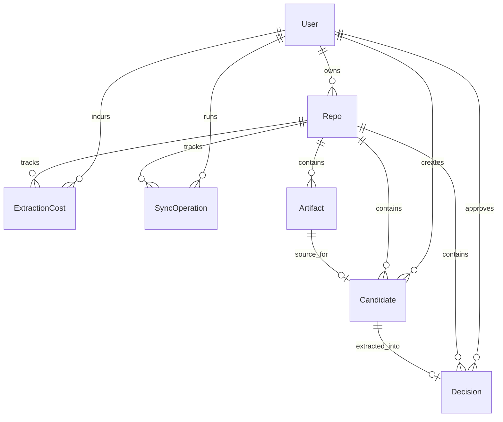

# Database Schema

## Entity Relationship Diagram

## Tables

### User (`users`)
| Field | Type | Description |
|---|---|---|
| id | String (cuid) | Primary key |
| githubId | Int | Unique GitHub user ID |
| login | String | Unique GitHub login |
| name | String? | Display name |
| email | String? | Email |
| avatarUrl | String? | Avatar URL |
| githubTokenEncrypted | String? | Encrypted GitHub token |
| githubTokenIv | String? | IV for encrypted token |
| createdAt | DateTime | Creation timestamp |
| updatedAt | DateTime | Last update timestamp |

### Repo (`repos`)
| Field | Type | Description |
|---|---|---|
| id | String (cuid) | Primary key |
| githubId | Int | Unique GitHub repo ID |
| owner | String | Repo owner login |
| name | String | Repo name |
| fullName | String | Unique `owner/name` |
| private | Boolean | Visibility flag |
| defaultBranch | String | Default branch name |
| userId | String | FK to `users.id` |
| enabled | Boolean | Tracking enabled flag |
| cursor | String? | Incremental sync cursor |
| lastSyncAt | DateTime? | Last sync timestamp |
| syncStatus | String | Sync status (`idle`, `syncing`, `error`) |
| createdAt | DateTime | Creation timestamp |
| updatedAt | DateTime | Last update timestamp |

### Artifact (`artifacts`)
| Field | Type | Description |
|---|---|---|
| id | String (cuid) | Primary key |
| repoId | String | FK to `repos.id` |
| githubId | Int | PR number / commit ID surrogate |
| type | String | `pr` or `commit` |
| url | String | Source URL |
| branch | String? | Branch name |
| title | String | Artifact title |
| author | String | Author login/name |
| authoredAt | DateTime | Authored timestamp |
| mergedAt | DateTime? | Merge timestamp |
| body | String? | PR/commit body |
| diff | String? | Truncated diff content |
| filesChanged | Int | Number of files changed |
| additions | Int | Added lines |
| deletions | Int | Deleted lines |
| createdAt | DateTime | Creation timestamp |
| updatedAt | DateTime | Last update timestamp |

### Candidate (`candidates`)
| Field | Type | Description |
|---|---|---|
| id | String (cuid) | Primary key |
| repoId | String | FK to `repos.id` |
| artifactId | String | Unique FK to `artifacts.id` |
| sieveScore | Float | Heuristic score (0.0 - 1.0) |
| scoreBreakdown | Json | Breakdown object |
| status | String | `pending`, `extracted`, `dismissed`, `failed` |
| extractedAt | DateTime? | Extraction timestamp |
| dismissedAt | DateTime? | Dismiss timestamp |
| userId | String | FK to `users.id` |
| createdAt | DateTime | Creation timestamp |
| updatedAt | DateTime | Last update timestamp |

### Decision (`decisions`)
| Field | Type | Description |
|---|---|---|
| id | String (cuid) | Primary key |
| repoId | String | FK to `repos.id` |
| candidateId | String | Unique FK to `candidates.id` |
| title | String | Decision title |
| context | String | Why decision was needed |
| decision | String | What was decided |
| reasoning | String | Why this approach was chosen |
| consequences | String | Trade-offs and implications |
| alternatives | String? | Optional alternatives |
| tags | String[] | Tag list |
| significance | Float | Decision significance score |
| extractedBy | String | Model/source identifier |
| rawResponse | Json | Full extraction payload |
| userId | String | FK to `users.id` |
| createdAt | DateTime | Creation timestamp |
| updatedAt | DateTime | Last update timestamp |

### ExtractionCost (`extraction_costs`)
| Field | Type | Description |
|---|---|---|
| id | String (cuid) | Primary key |
| userId | String | FK to `users.id` |
| repoId | String | FK to `repos.id` |
| model | String | Model name |
| inputTokens | Int | Input tokens |
| outputTokens | Int | Output tokens |
| totalCost | Float | Total USD cost |
| batchSize | Int | Batch size |
| candidateIds | String[] | Candidate IDs processed |
| extractedAt | DateTime | Extraction timestamp |

### SyncOperation (`sync_operations`)
| Field | Type | Description |
|---|---|---|
| id | String (cuid) | Primary key |
| userId | String | FK to `users.id` |
| repoId | String | FK to `repos.id` |
| status | String | `success`, `error`, `partial` |
| startedAt | DateTime | Start timestamp |
| completedAt | DateTime? | Completion timestamp |
| fetchedCount | Int | Number fetched |
| sievedCount | Int | Number passing sieve |
| extractedCount | Int | Number extracted |
| errorCount | Int | Number of errors |
| errorMessage | String? | Error message |
| errorCode | String? | Error code |
| startCursor | String? | Start cursor |
| endCursor | String? | End cursor |

## Indexes

- `Repo`: unique `(userId, fullName)`, index `(userId, enabled)`.
- `Artifact`: unique `(repoId, githubId, type)`, indexes `(repoId, type)` and `(repoId, authoredAt)`.
- `Candidate`: unique `(repoId, artifactId)` plus unique `artifactId`, indexes `(repoId, status, sieveScore)` and `(userId, status)`.
- `Decision`: unique `(repoId, candidateId)` plus unique `candidateId`, indexes `(repoId, createdAt)` and `(userId)`.
- `ExtractionCost`: indexes `(userId, repoId, extractedAt)` and `(repoId, extractedAt)`.
- `SyncOperation`: indexes `(repoId, startedAt)` and `(userId, startedAt)`.

## Notes

- All timestamp fields are Prisma `DateTime` values and are stored in UTC-compatible DB timestamp columns.
- Decision version history is not modeled as a dedicated relational table.
- Candidate-to-decision and artifact-to-candidate are one-to-one links enforced by unique constraints.
