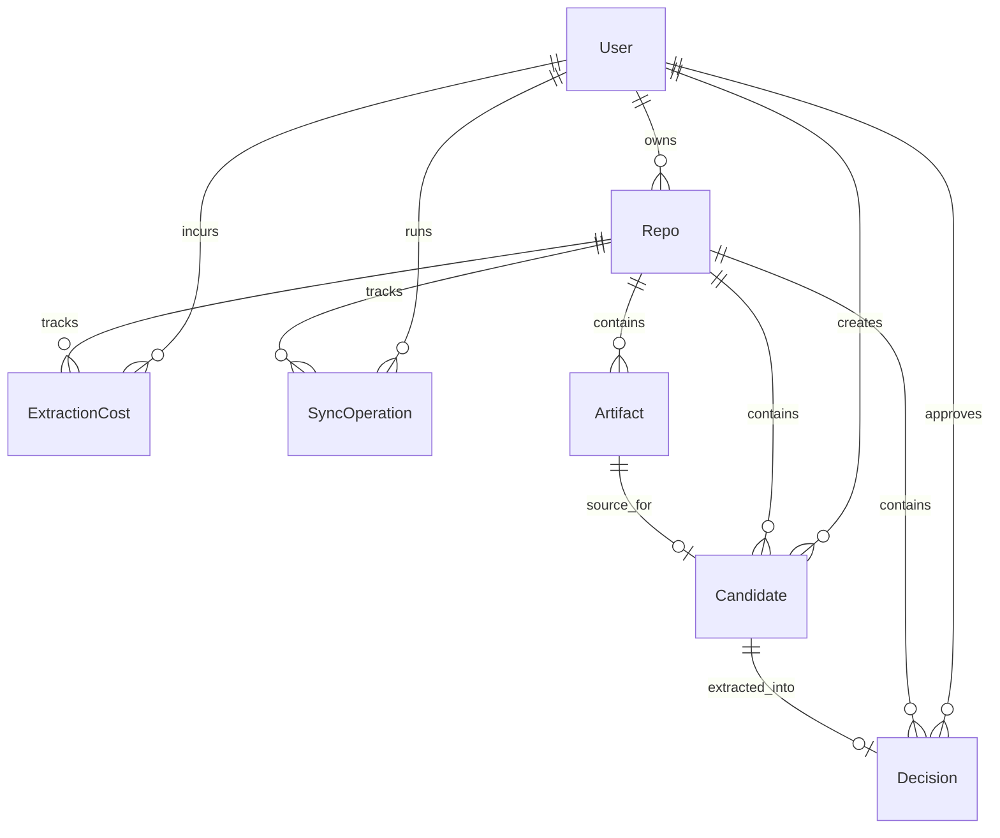

# Database Schema

## Entity Relationship Diagram

## Tables

### User (`users`)

| Field | Type | Description |
|-------|------|-------------|
| id | String (cuid) | Primary key |
| githubId | Int | Unique GitHub user ID |
| login | String | Unique GitHub login handle |
| name | String? | Display name (nullable) |
| email | String? | Email address (nullable) |
| avatarUrl | String? | GitHub avatar URL (nullable) |
| githubTokenEncrypted | String? | AES-256-GCM encrypted GitHub PAT |
| githubTokenIv | String? | Initialization vector for token decryption |
| createdAt | DateTime | Record creation timestamp |
| updatedAt | DateTime | Last update timestamp (auto-managed) |

### Repo (`repos`)

| Field | Type | Description |
|-------|------|-------------|
| id | String (cuid) | Primary key |
| githubId | Int | Unique GitHub repository ID |
| owner | String | Repository owner login |
| name | String | Repository name |
| fullName | String | Unique qualified name (`owner/repo`) |
| private | Boolean | Whether the repo is private (default: `false`) |
| defaultBranch | String | Default branch name (default: `"main"`) |
| userId | String | FK to `users.id` (cascade delete) |
| enabled | Boolean | Whether sync tracking is enabled (default: `false`) |
| cursor | String? | Last sync cursor for incremental fetching (e.g., `pr:42`) |
| lastSyncAt | DateTime? | Timestamp of last successful sync |
| syncStatus | String | Current sync state: `idle`, `syncing`, or `error` (default: `"idle"`) |
| createdAt | DateTime | Record creation timestamp |
| updatedAt | DateTime | Last update timestamp (auto-managed) |

### Artifact (`artifacts`)

Stores raw PR and commit data fetched from GitHub.

| Field | Type | Description |
|-------|------|-------------|
| id | String (cuid) | Primary key |
| repoId | String | FK to `repos.id` (cascade delete) |
| githubId | Int | PR number or commit identifier |
| type | String | Source type: `"pr"` or `"commit"` |
| url | String | GitHub URL for the PR or commit |
| branch | String? | Branch name (nullable) |
| title | String | PR title or commit message subject |
| author | String | Author login or name |
| authoredAt | DateTime | When the PR/commit was authored |
| mergedAt | DateTime? | When the PR was merged (nullable, PRs only) |
| body | String? | PR body or commit message body |
| diff | String? | Unified diff content (truncated to first 100KB) |
| filesChanged | Int | Number of files changed (default: `0`) |
| additions | Int | Lines added (default: `0`) |
| deletions | Int | Lines deleted (default: `0`) |
| createdAt | DateTime | Record creation timestamp |
| updatedAt | DateTime | Last update timestamp (auto-managed) |

### Candidate (`candidates`)

PRs/commits that passed the sieve threshold (score >= 0.4) and are eligible for LLM extraction.

| Field | Type | Description |
|-------|------|-------------|
| id | String (cuid) | Primary key |
| repoId | String | FK to `repos.id` (cascade delete) |
| artifactId | String | Unique FK to `artifacts.id` (cascade delete) |
| sieveScore | Float | Heuristic significance score (0.0–1.0) |
| scoreBreakdown | Json | Detailed scoring breakdown (`{ commitScore, prScore, diffScore, details }`) |
| status | String | Processing state: `pending`, `extracted`, `dismissed`, or `failed` |
| extractedAt | DateTime? | When LLM extraction was performed |
| dismissedAt | DateTime? | When the candidate was dismissed by the user |
| userId | String | FK to `users.id` (cascade delete) |
| createdAt | DateTime | Record creation timestamp |
| updatedAt | DateTime | Last update timestamp (auto-managed) |

### Decision (`decisions`)

Structured Architecture Decision Records extracted by the LLM from approved candidates.

| Field | Type | Description |
|-------|------|-------------|
| id | String (cuid) | Primary key |
| repoId | String | FK to `repos.id` (cascade delete) |
| candidateId | String | Unique FK to `candidates.id` (cascade delete) |
| title | String | Decision title |
| context | String | Why this decision was needed |
| decision | String | What was decided |
| reasoning | String | Why this approach was chosen over alternatives |
| consequences | String | Trade-offs, implications, and downstream effects |
| alternatives | String? | Alternatives that were considered (nullable) |
| tags | String[] | Tag labels (e.g., `["architecture", "security", "performance"]`) |
| significance | Float | Significance score (0.0–1.0, derived from sieve score) |
| extractedBy | String | Model identifier (e.g., `"claude-sonnet-4"`, `"gpt-4o"`) |
| rawResponse | Json | Full LLM response payload for debugging and audit |
| userId | String | FK to `users.id` — user who approved extraction (cascade delete) |
| createdAt | DateTime | Record creation timestamp |
| updatedAt | DateTime | Last update timestamp (auto-managed) |

### ExtractionCost (`extraction_costs`)

Tracks LLM token usage and cost per extraction for budget management.

| Field | Type | Description |
|-------|------|-------------|
| id | String (cuid) | Primary key |
| userId | String | FK to `users.id` (cascade delete) |
| repoId | String | FK to `repos.id` (cascade delete) |
| model | String | Model name (e.g., `"claude-sonnet-4"`, `"gpt-4o"`) |
| inputTokens | Int | Number of input tokens consumed |
| outputTokens | Int | Number of output tokens generated |
| totalCost | Float | Total cost in USD |
| batchSize | Int | Number of PRs processed in this extraction call (default: `1`) |
| candidateIds | String[] | Array of candidate IDs processed in this batch |
| extractedAt | DateTime | When extraction occurred |

### SyncOperation (`sync_operations`)

Audit trail for every sync run, tracking what was fetched, sieved, and any errors.

| Field | Type | Description |
|-------|------|-------------|
| id | String (cuid) | Primary key |
| userId | String | FK to `users.id` (cascade delete) |
| repoId | String | FK to `repos.id` (cascade delete) |
| status | String | Outcome: `"success"`, `"error"`, or `"partial"` |
| startedAt | DateTime | When the sync started |
| completedAt | DateTime? | When the sync finished |
| fetchedCount | Int | Number of PRs/commits fetched from GitHub (default: `0`) |
| sievedCount | Int | Number of artifacts passing the sieve threshold (default: `0`) |
| extractedCount | Int | Number of decisions extracted (default: `0`) |
| errorCount | Int | Number of errors encountered (default: `0`) |
| errorMessage | String? | Error message if status is `"error"` |
| errorCode | String? | Error code if status is `"error"` |
| startCursor | String? | Cursor position at sync start |
| endCursor | String? | Cursor position at sync end |

## Indexes

| Table | Index | Fields | Purpose |
|-------|-------|--------|---------|
| Repo | Unique | `(userId, fullName)` | One repo record per user per qualified name |
| Repo | Index | `(userId, enabled)` | Fast lookup of a user's tracked repos |
| Artifact | Unique | `(repoId, githubId, type)` | Prevent duplicate artifacts per repo |
| Artifact | Index | `(repoId, type)` | Filter artifacts by type within a repo |
| Artifact | Index | `(repoId, authoredAt)` | Chronological artifact queries |
| Candidate | Unique | `(repoId, artifactId)` | One candidate per artifact per repo |
| Candidate | Index | `(repoId, status, sieveScore)` | Ordered candidate listing with status filter |
| Candidate | Index | `(userId, status)` | User's candidates by status |
| Decision | Unique | `(repoId, candidateId)` | One decision per candidate per repo |
| Decision | Index | `(repoId, createdAt)` | Chronological decision listing |
| Decision | Index | `(userId)` | User's decisions |
| ExtractionCost | Index | `(userId, repoId, extractedAt)` | Cost queries scoped to user and repo |
| ExtractionCost | Index | `(repoId, extractedAt)` | Repo-level cost timeline |
| SyncOperation | Index | `(repoId, startedAt)` | Sync history per repo |
| SyncOperation | Index | `(userId, startedAt)` | Sync history per user |

## Notes

- All timestamp fields use Prisma `DateTime` and are stored in UTC.
- Decision version history is not modeled as a dedicated relational table. Timeline ordering uses `Decision.createdAt`, and provenance is traced through the Candidate → Artifact chain back to the source PR.
- Candidate-to-Decision and Artifact-to-Candidate are one-to-one links enforced by unique constraints on `candidateId` and `artifactId`.
- All foreign keys use cascade delete — removing a User or Repo removes all dependent records.
- GitHub tokens are stored encrypted (AES-256-GCM) with a separate IV column. The encryption key is derived from `JWT_SECRET` via PBKDF2.
